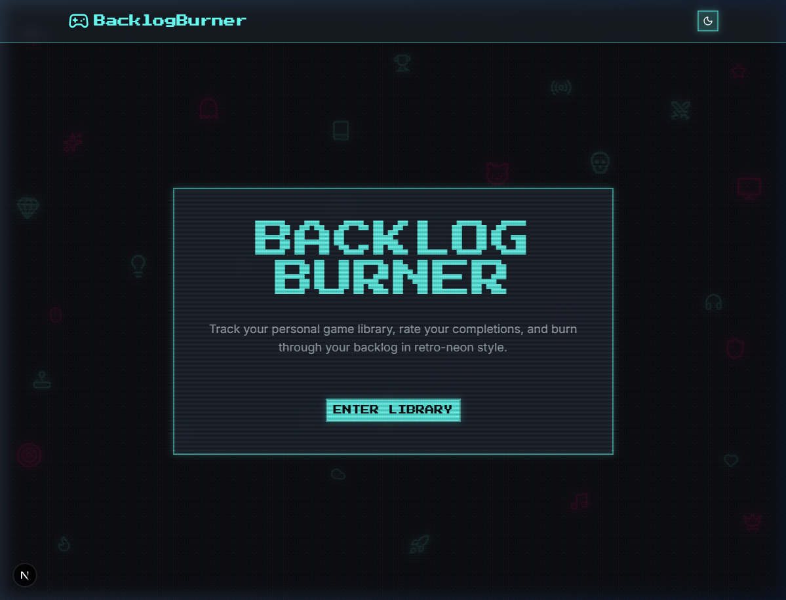

# 🕹️ BacklogBurner

[](https://nextjs.org/)
[](https://tailwindcss.com/)
[](https://orm.drizzle.team/)
[](https://supabase.com/)

---

## 🚀 The Vision
**BacklogBurner** is a retro-neon game library tracker designed for gamers who want to conquer their digital pile of shame in style. It's not just a tracker; it's a high-octane dashboard for your gaming journey.



---

## ✨ Features

- **👾 Retro-Neon Aesthetic**: A 2D CRT-inspired design with vibrant glow effects and scanline overlays.
- **📚 Library Management**: Easily add, update, and track your games across all platforms.
- **🔥 Status Tracking**: Mark games as "Playing", "Completed", or "Dropped" and burn through your backlog.
- **⚡ Fast Search**: Instant filtering and search capabilities powered by TanStack Query.
- **📱 Responsive Design**: Manage your library on any device, from desktop to mobile.

---

## 🛠️ Tech Stack

- **Framework**: [Next.js 15 (App Router)](https://nextjs.org/)
- **Styling**: [Tailwind CSS 4](https://tailwindcss.com/) + [shadcn/ui](https://ui.shadcn.com/)
- **Database**: [PostgreSQL (Supabase)](https://supabase.com/)
- **ORM**: [Drizzle ORM](https://orm.drizzle.team/)
- **State Management**: [Zustand](https://github.com/pmndrs/zustand)
- **Data Fetching**: [TanStack Query v5](https://tanstack.com/query/latest)

---

## 🚦 Getting Started

### Prerequisites
- Node.js 20+
- A Supabase account (PostgreSQL)

### Installation

1. **Clone the repository:**
   ```bash
   git clone https://github.com/twiners212/BacklogBurner.git
   cd BacklogBurner
   ```

2. **Install dependencies:**
   ```bash
   npm install
   ```

3. **Set up environment variables:**
   Create a `.env.local` file and add your Supabase connection string:
   ```env
   DATABASE_URL=your_postgresql_url
   ```

4. **Run the development server:**
   ```bash
   npm run dev
   ```

Open [http://localhost:3000](http://localhost:3000) with your browser to see the result.

---

## 📖 About

### The Mission
In an era of endless digital sales and game passes, our libraries grow faster than our free time. **BacklogBurner** was born from the frustration of seeing a list of 500+ unplayed games and not knowing where to start. 

The goal was to create an interface that feels like a classic arcade terminal—evoking the nostalgia of 80s and 90s gaming—while providing modern, snappy performance. We believe that tracking your progress should be as fun as playing the games themselves.

### Why Retro-Neon?
We chose the neon-on-dark aesthetic to minimize eye strain during late-night gaming sessions and to celebrate the "cyberpunk" future we were promised in the golden age of arcade gaming. Every glow, scanline, and pixel-font choice is intentional, designed to make your backlog feel like a high-score leaderboard waiting to be topped.

---

## 📄 License
This project is licensed under the MIT License.

---

*Built with ❤️ by [twiners212](https://github.com/twiners212)*
